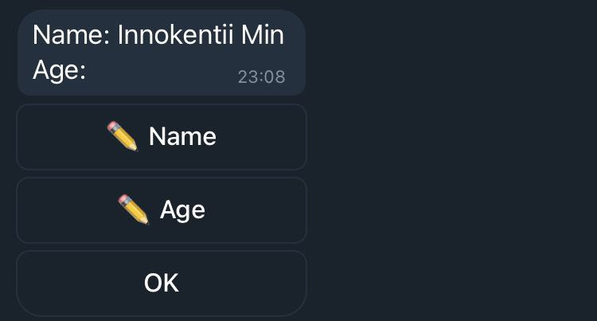

# Formgram
Small extension for pyTelegramBotAPI library for building interactive forms in Telegram bots without storing intermediate state.


## Install

I haven't published the package on PyPI yet. If you want to use `formgram` on this early stage, please just **vendor it**. It is a single file: [formgram.py](formgram.py). I already created [the issue to distribute the package via PyPI](https://github.com/keshamin/formgram/issues/2).


## Demo


Demo GIF for [docs/examples/example.py](docs/examples/example.py):


## Docs

### Create a Form

Forms are class-based. To create a form inherit from a `BaseForm` class and configure it with class attributes.

|                     | Mandatory? | Default | Type                                                      | Description                                                                                                                                                           |
|---------------------|------------|---------|-----------------------------------------------------------|-----------------------------------------------------------------------------------------------------------------------------------------------------------------------|
| `bot`               | **Yes**    |         | `telebot.TeleBot`                                         | Bot object to use for serving form                                                                                                                                    |
| `submit_callback`   | **Yes**    |         | `Callable[[BaseForm, telebot.types.CallbackQuery], None]` | `f(form, callback_query)` that is invoked on form submission                                                                                                          |
| `cancel_callback`   | No         | `None`  | `Callable[[BaseForm, telebot.types.CallbackQuery], None]` | `f(form, callback_query)` that is invoke on form cancelation. `Cancel` button appears if only cancel_callback provided (not `None`).                                               |
| `custom_buttons`    | No         | `[]`    | `List[CustomButton]`                                      | Custom buttons display in the end of form's keyboard, right before `OK`/`Cancel` buttons.                                                                             |
| `separator`         | No         | `': '`  | `str`                                                     | A string to put between field label and field value in the form state message                                                                                         |
| `missing_value_str` | No         | `''`    | `str`                                                     | A string that is considered as a None. If field value is None it displays as `missing_value_str`. Input value equal to `missing_value_str` is also converted to None. |

Minimal form:

```python
import formgram as fg
import telebot

TOKEN = 'BOT_TOKEN_HERE'
bot = telebot.TeleBot(TOKEN)

class UserForm(fg.BaseForm):
    bot = bot
    submit_callback = lambda form, cq: bot.send_message(cq.message.chat.id, f'New user {form.name} of {form.age}')
    
    name = fg.StrField(label='Name', required=True)
    age = fg.IntField(label='Age')
```

### Send a Form

After you defined a form use `form.send_form(chat_id)` method to send it to user.

Simple example that sends the `UserForm` form from above code snippet:
```python
@bot.message_handler(commands=['form'])
def send_form(message: telebot.types.Message):
    form = UserForm()
    form.send_form(chat_id=message.chat.id)
```

**That is it!** Formgram takes care of the rest! All fields editing is handled automatically and submit/cancel callbacks are invoked when the form is completed/canceled. 




### Fields

There's a set of **common field options**. They are applicable to all field types, but some options can be irrelevant to certain field types. When so, the corresponding information can be found in the field type's section below.

Common field options:

| Option         | Type / Default            | Description                                                                                                                       |
|----------------|---------------------------|-----------------------------------------------------------------------------------------------------------------------------------|
| `required`       | `bool` / `False`              | Required field has to be **not None** before form can be submitted.                                                          |
| `initial_value` | `Optional[object]` / `None` | Initial value of the field, which still can be modified by user then.                                                            |
| `label`          | `Optional[str]` / `None`    | User-visible field name. If omitted the class attribute name is used instead.                                                  |
| `read_only`     | `bool` / `False`              | If field is `read_only` user doesn't have a button to modify the field value. Value can be modified only manually from the code. |
| `noneable`       | `bool` / `True`               | If the field can take `None` as a value. Therefore: when not `noneable` the field must have an `initial_value`.                       |
